## 开发

### macOS 终端查看某一端口占用程序并杀死该程序

要在 macOS 终端中查看某一端口的占用程序并杀死该程序，可以使用以下命令：

1. 首先，通过 `lsof` 命令查找占用指定端口的程序。运行以下命令，将 `<port_number>` 替换为你要查找的端口号：

```shell
lsof -i :<port_number>
```

例如，要查找占用端口号 8080 的程序，可以运行以下命令：

```shell
lsof -i :8080
```

2. 终端将显示占用该端口的程序的信息，包括 PID（进程标识符）和程序名称。记录下 PID。

3. 使用 `kill` 命令杀死指定 PID 的程序。运行以下命令，将 `<pid>` 替换为上一步中记录的 PID：

```shell
kill <pid>
```

例如，如果上一步中获取的 PID 为 12345，可以运行以下命令杀死该进程：

```shell
kill 12345
```

请确保谨慎使用 `kill` 命令，并确保你要终止的进程是正确的，以避免意外关闭其他重要进程。

### macOS 终端查看本机本地 ip 地址

在 macOS 终端中，你可以使用 `ifconfig` 命令来查看本机的本地 IP 地址。以下是具体步骤：

1. 打开终端应用程序。
2. 运行以下命令：

```shell
ifconfig
```

3. 终端将显示网络接口的详细信息。查找你当前使用的网络接口，可能是类似于 `en0`、`en1` 或 `wlan0` 的标识符。
4. 在相应的网络接口部分，查找名为 `inet` 的行。该行将显示你的本地 IP 地址。

示例输出：

```
en0: flags=8863<UP,BROADCAST,SMART,RUNNING,SIMPLEX,MULTICAST> mtu 1500
    ...
    inet 192.168.1.123 netmask 0xffffff00 broadcast 192.168.1.255
    ...
```

在上述示例中，本地 IP 地址为 `192.168.1.123`。

请注意，`ifconfig` 命令还提供其他有关网络接口的信息，如 MAC 地址、子网掩码等。

## 日常

### 显示磁盘状态

```shell
diskutil apfs list
```

```shell
mikeshinoda@MikedeMacBook-Air ~> diskutil apfs list
APFS Containers (4 found)
|
+-- Container disk3 BB9FA2B0-01A2-48A3-AC3D-86911A9D82A1
|   ====================================================
|   APFS Container Reference:     disk3
|   Size (Capacity Ceiling):      494384795648 B (494.4 GB)
|   Capacity In Use By Volumes:   363483443200 B (363.5 GB) (73.5% used)
|   Capacity Not Allocated:       130901352448 B (130.9 GB) (26.5% free)
|   |
|   +-< Physical Store disk0s2 1C8AE143-6FA9-4FE3-90A9-5224CF737B2A
|   |   -----------------------------------------------------------
|   |   APFS Physical Store Disk:   disk0s2
|   |   Size:                       494384795648 B (494.4 GB)
|   |
|   +-> Volume disk3s1 4B72EF1D-334A-4874-936F-E1118C406D6F
|   |   ---------------------------------------------------
|   |   APFS Volume Disk (Role):   disk3s1 (Data)
|   |   Name:                      Macintosh HD - Data (Case-insensitive)
|   |   Mount Point:               /System/Volumes/Data
|   |   Capacity Consumed:         348700340224 B (348.7 GB)
|   |   Sealed:                    No
|   |   FileVault:                 Yes (Unlocked)
|   |
|   +-> Volume disk3s3 227F0CDD-64C3-4A09-85EB-5C32A2120F77
|   |   ---------------------------------------------------
|   |   APFS Volume Disk (Role):   disk3s3 (System)
|   |   Name:                      Macintosh HD (Case-insensitive)
|   |   Mount Point:               Not Mounted
|   |   Capacity Consumed:         9061601280 B (9.1 GB)
|   |   Sealed:                    Broken
|   |   FileVault:                 Yes (Unlocked)
|   |   Encrypted:                 No
|   |   |
|   |   Snapshot:                  7F4E9223-2A2D-42C9-A6FD-03C1875826EF
|   |   Snapshot Disk:             disk3s3s1
|   |   Snapshot Mount Point:      /
|   |   Snapshot Sealed:           Yes
|   |
|   +-> Volume disk3s4 A201C401-B3A6-4F53-8485-B43239001F4B
|   |   ---------------------------------------------------
|   |   APFS Volume Disk (Role):   disk3s4 (Preboot)
|   |   Name:                      Preboot (Case-insensitive)
|   |   Mount Point:               /System/Volumes/Preboot
|   |   Capacity Consumed:         4698144768 B (4.7 GB)
|   |   Sealed:                    No
|   |   FileVault:                 No
|   |
|   +-> Volume disk3s5 62EF1E30-795B-4A63-B0FB-7C4B23A68E2F
|   |   ---------------------------------------------------
|   |   APFS Volume Disk (Role):   disk3s5 (Recovery)
|   |   Name:                      Recovery (Case-insensitive)
|   |   Mount Point:               Not Mounted
|   |   Capacity Consumed:         797224960 B (797.2 MB)
|   |   Sealed:                    No
|   |   FileVault:                 No
|   |
|   +-> Volume disk3s6 B58FFE7A-A1D6-409D-AB86-0DF06B3B0E38
|       ---------------------------------------------------
|       APFS Volume Disk (Role):   disk3s6 (VM)
|       Name:                      VM (Case-insensitive)
|       Mount Point:               /System/Volumes/VM
|       Capacity Consumed:         20480 B (20.5 KB)
|       Sealed:                    No
|       FileVault:                 No
|
+-- Container disk5 173DEC75-C6B4-4FD8-88D4-78AF1EAA9286
    ====================================================
    APFS Container Reference:     disk5
    Size (Capacity Ceiling):      1791962529792 B (1.8 TB)
    Capacity In Use By Volumes:   377045164032 B (377.0 GB) (21.0% used)
    Capacity Not Allocated:       1414917365760 B (1.4 TB) (79.0% free)
    |
    +-< Physical Store disk4s2 0A148F6F-AF8D-4CA4-B4A5-AB91F5155B76
    |   -----------------------------------------------------------
    |   APFS Physical Store Disk:   disk4s2
    |   Size:                       1791962529792 B (1.8 TB)
    |
    +-> Volume disk5s1 BA3A5BB1-4F1F-42DA-840E-E5B5B67872F9
    |   ---------------------------------------------------
    |   APFS Volume Disk (Role):   disk5s1 (No specific role)
    |   Name:                      2T SSD (Case-insensitive)
    |   Mount Point:               /Volumes/2T SSD
    |   Capacity Consumed:         3035889664 B (3.0 GB)
    |   Sealed:                    No
    |   FileVault:                 No
    |
    +-> Volume disk5s3 BCD1F4E4-35D7-4A46-9832-6E561E4FCACE
    |   ---------------------------------------------------
    |   APFS Volume Disk (Role):   disk5s3 (Backup)
    |   Name:                      Time Machine (Case-sensitive)
    |   Mount Point:               /Volumes/Time Machine
    |   Capacity Consumed:         297486266368 B (297.5 GB)
    |   Sealed:                    No
    |   FileVault:                 Yes (Unlocked)
    |
    +-> Volume disk5s2 B10F37D0-89BE-4954-8BD0-952516144060
        ---------------------------------------------------
        APFS Volume Disk (Role):   disk5s2 (No specific role)
        Name:                      Cherry (Case-insensitive)
        Mount Point:               /Volumes/Cherry
        Capacity Consumed:         76242427904 B (76.2 GB)
        Sealed:                    No
        Encryption Progress:       10.0% (Unlocked)
```

### Unlock or decrypt your FileVault-encrypted boot drive from the command line on macOS Mojave

January 15, 2019[rtrouton](https://derflounder.wordpress.com/author/rtrouton/)[Leave a comment](https://derflounder.wordpress.com/2019/01/15/unlock-or-decrypt-your-filevault-encrypted-boot-drive-from-the-command-line-on-macos-mojave/#respond)[Go to comments](https://derflounder.wordpress.com/2019/01/15/unlock-or-decrypt-your-filevault-encrypted-boot-drive-from-the-command-line-on-macos-mojave/#comments)

As part of working with FileVault on macOS Mojave, it may be necessary to decrypt an encrypted boot drive in order to fix a problem. On Mojave all boot volumes will use Apple File System (APFS), so to unlock or decrypt an encrypted boot drive from the command line, you will need to do the following:

1. Identify the relevant encrypted APFS volume
2. Unlock the encrypted APFS volume
3. If needed, decrypt the encrypted APFS volume

For more details, see below the jump.

**Identifying the encrypted APFS volume**

A necessary pre-requisite to unlocking APFS encryption is to identify the correct encrypted volume. To do this, open Terminal and run the following command:

```
diskutil apfs list
```

Running that command will give you a listing of all APFS containers and volumes. To help identify what you’re looking for, I’ve highlighted the identifier of the encrypted APFS volume in this example:

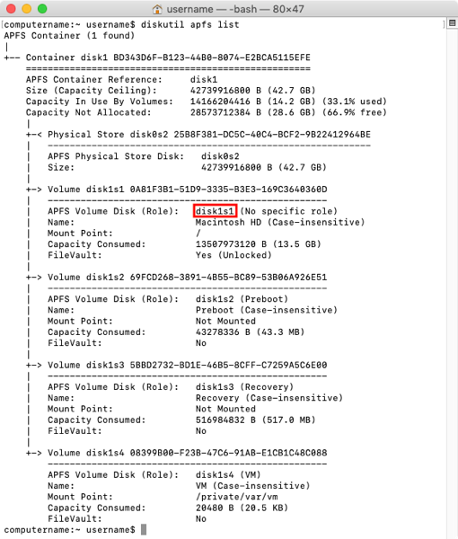

**Unlocking the encrypted APFS volume**

If you have access to the password of one of the enabled accounts on the encrypted APFS volume, you can unlock using the command shown on the screen. You will be prompted to provide the password.

```shell
diskutil apfs unlockVolume /dev/apfs_volume_id_goes_here
```

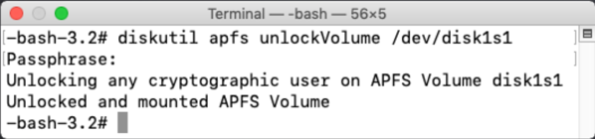

If you have access to the personal recovery key associated with the encrypted APFS volume, you can unlock using the command shown on the screen. You will need to provide the recovery key as part of the command.

```shell
diskutil apfs unlockVolume /dev/apfs_volume_id_goes_here -passphrase personal_recovery_key_goes_here
```

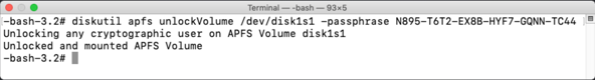

If using an institutional recovery key, you can unlock the encryption using a FileVaultMaster keychain that contains both the public and private key of your institutional recovery key. One requirement is that you will need to be booted from a Recovery HD partition or from Internet Recovery. Here’s how to do this:

1. Copy the FileVaultMaster keychain that contains both the public and private key of your institutional recovery key to a drive that you can access from Recovery HD.
2. Boot to Recovery HD.

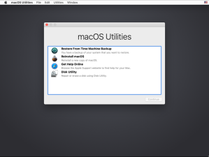

3. Open Terminal.
4. Get the APFS volume ID of the encrypted drive by running the following command:

```
diskutil apfs list
```

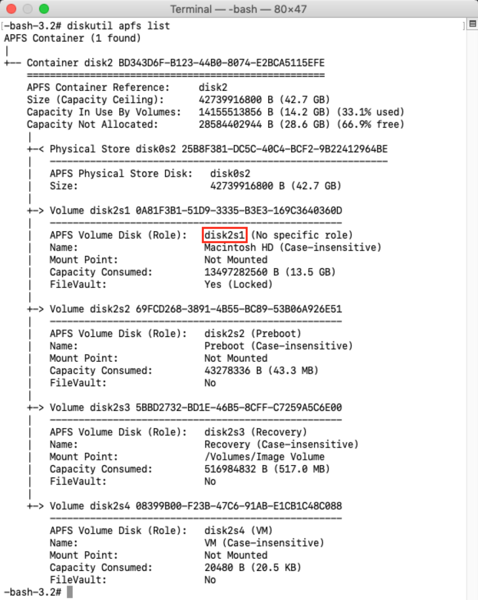

5. With the APFS volume ID information acquired, run the following command to unlock the FileVaultMaster.keychain:

```
security unlock-keychain /path/to/FileVaultMaster.keychain
```

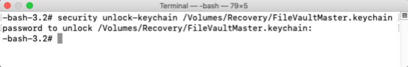

Once this command is run, you’ll need to enter the keychain’s password when prompted. If the password is accepted, you’ll be taken to the next prompt.

6. Run the following command to unlock the encrypted APFS volume on the encrypted Mac:

```
diskutil apfs unlockVolume /dev/apfs_volume_id_goes_here -recoverykeychain /path/to/FileVaultMaster.keychain
```

7. You should then see output similar to the following:

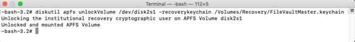

**Decrypting the encrypted APFS volume**

Once the drive has been unlocked, you can then decrypt the APFS volume. In order to decrypt using a user account’s password or a recovery key, it is necessary to specify the following:

1. The relevant encrypted APFS volume
2. The relevant user UUID, unless using an institutional recovery key.
3. The relevant account password, personal recovery key or institutional recovery key.

If you are planning to use a user account’s password to decrypt, you will first need to correctly identify the relevant encrypted APFS volume and which UUID you want to use. The encrypted APFS volume must also be unlocked and ready for decryption

You can get the UUID of a user account by running the command shown below and matching which UUID belongs to the account you want to use.

```
fdesetup list
```

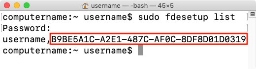

If you are not booted from the encrypted drive, there is another way to get the UUID but it does not include the account name.

```
diskutil apfs listcryptousers /dev/apfs_volume_id_goes_here
```

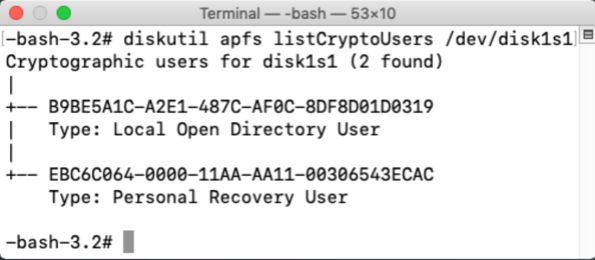

In this case, use the UUID associated with the **Local Open Directory User** entry.

Unfortunately, this may lead to some guesswork on your part if there is more than one FileVault enabled account enabled. With multiple accounts enabled, there will be will be multiple **Local Open Directory User** entries.

**Decrypting using an account password:**

Once you have access to the UUID and password of one of the enabled accounts on the encrypted APFS volume, you can decrypt using the command below. You will be prompted to provide the password:

```
diskutil apfs decryptVolume /dev/apfs_volume_id_goes_here -user uuid_goes_here
```

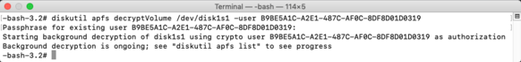

**Decrypting using a personal recovery key:**

If you want to use the personal recovery key, the PRK has its own UUID which only appears if you run the following command:

```
diskutil apfs listcryptousers /dev/apfs_volume_id_goes_here
```

In this case, use the UUID associated with the **Personal Recovery User** entry.

If you have access to the personal recovery key associated with the encrypted APFS volume, you can decrypt using the command below. You will need to provide the relevant UUID and the alphanumeric recovery key as part of the command.

```
diskutil apfs decryptVolume /dev/apfs_volume_id_goes_here -user uuid_goes_here -passphrase personal_recovery_key_goes_here
```

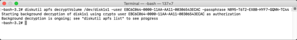

**Decrypting using an institutional recovery key:**

If you want to use the institutional recovery key, decryption using an IRK does not require the use of UUIDs. Instead, once the recovery key and the encrypted drive have both been unlocked, you can decrypt using the command shown below.

```
diskutil apfs decryptVolume /dev/apfs_volume_id_goes_here -recoverykeychain /path/to/filename_here.keychain
```

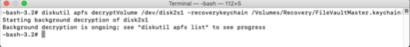

**Monitoring decryption**

You can monitor decryption of the APFS volume from the command line by running the following command:

```
diskutil apfs list
```

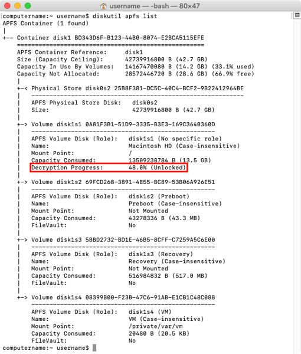

You can also monitor it via the following means:

1. Boot from the decrypting drive.
2. Open System Preferences
3. Open the **Security & Privacy** preference pane
4. Click the **FileVault** tab
5. View the current decryption status

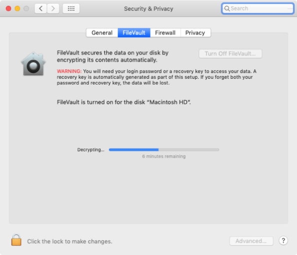
