标签

- #数据结构

## 顺序查找和折半查找

### 顺序查找

### 折半查找

### 分块查找

## 树型查找

### 二叉排序树（BST）

#### 构造一棵二叉排序树

现有序列：61 87 59 47 35 73 51 98 37 93

构造过程如下：
1）索引 i = 0，A[i] = 61，结点 61 作为根结点，如图：

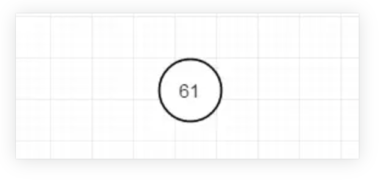

2）索引 i = 1，A[1] = 87, 87 > 61，且结点 61 右孩子为空，故 81 为 61 结点的右孩子，如图：

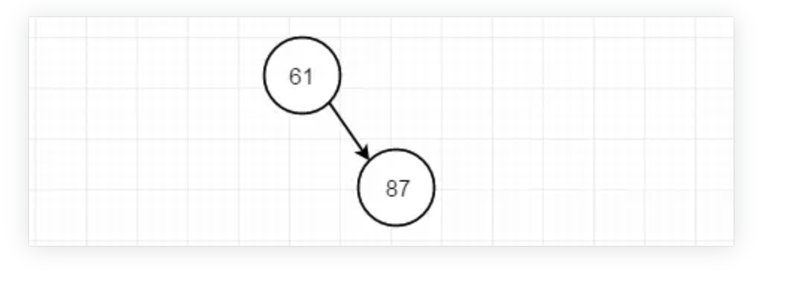

3）索引 i = 2，A[i] = 59，59 < 61，且结点 61 左孩子为空，故 59 为 61 结点的左孩子，如图：

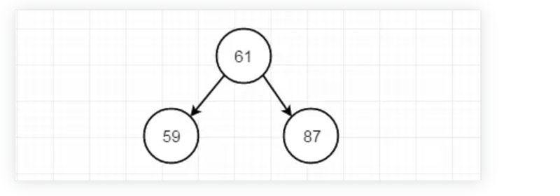

4）索引 i = 3，A[3] = 47，47 < 59，且结点 59 左孩子为空，故 47 为 59 结点的左孩子，如图：

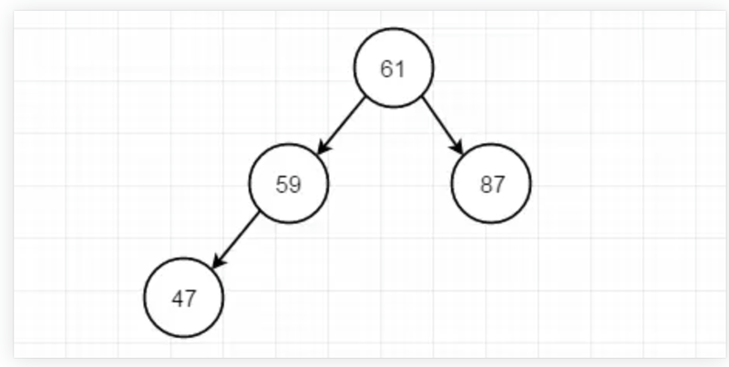

5）索引 i = 4，A[4] = 35，35 < 47，且结点 47 左孩子为空，故 35 为 47 结点的左孩子，如图：

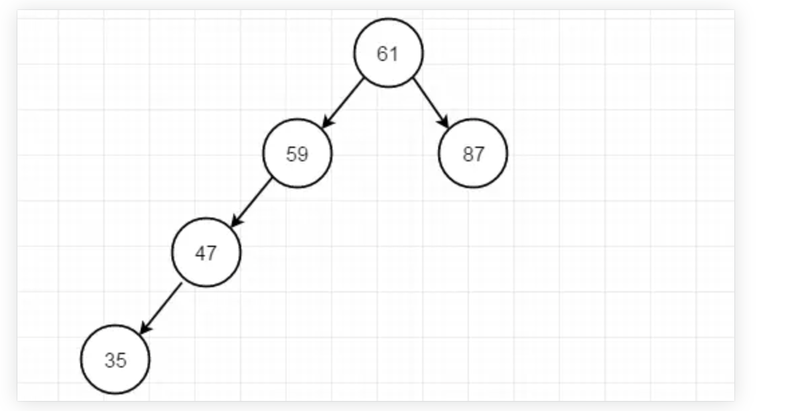

采用同样规则遍历整个数组得到如图所示的一棵排序二叉树。

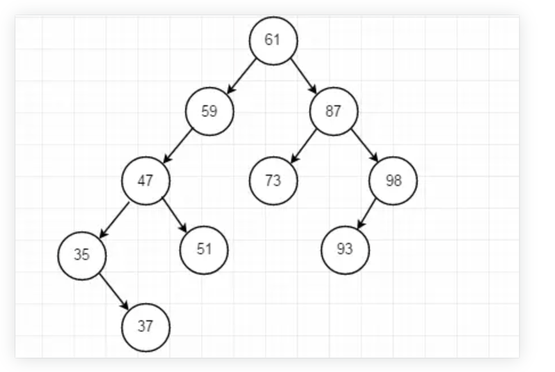

**二叉排序树查找**
由二叉树的递归定义性质，二叉排序树的查找同样可以使用如下递归算法查找。

> 如果树是空的，则查找结束，无匹配。
> 如果被查找的值和根结点的值相等，查找成功。否则就在子树中继续查找。如果被查找的值小于根结点的值就选择左子树，大于根结点的值就选择右子树。

在理想情况下，每次比较过后，树会被砍掉一半，近乎折半查找。
遍历打印可以使用中序遍历，打印出来的结果是从小到大的有序数组。
查找代码：

```cpp
typedef int Status; /* Status是函数的类型,其值是函数结果状态代码，如OK等 */

/* 二叉树的二叉链表结点结构定义 */
typedef  struct BiTNode /* 结点结构 */
{
    int data;   /* 结点数据 */
    struct BiTNode *lchild, *rchild;    /* 左右孩子指针 */
} BiTNode, *BiTree;


/* 递归查找二叉排序树T中是否存在key, */
/* 指针f指向T的双亲，其初始调用值为NULL */
/* 若查找成功，则指针p指向该数据元素结点，并返回TRUE */
/* 否则指针p指向查找路径上访问的最后一个结点并返回FALSE */
Status SearchBST(BiTree t, int key, BiTree f, BiTree *p)
{
    if (!t) /*  查找不成功 */
    {
        *p = f;
        return FALSE;
    }
    else if (key == t->data) /*  查找成功 */
    {
        *p = t;
        return TRUE;
    }
    else if (key < t->data)
        return SearchBST(t->lchild, key, t, p);  /*  在左子树中继续查找 */
    else
        return SearchBST(t->rchild, key, t, p);  /*  在右子树中继续查找 */
}
```

对于上图所示的二叉排序树，若查找结点 key 为 47 则可以查找成功，若查找结点 key 为 75，树中不存在 key 为 75 的结点，故查找失败，则查找指针 p 指向查找路径的最后一个结点，即结点 73。

**二叉排序树插入**
二叉排序的插入是建立在二叉排序的查找之上的，插入一个结点，就是通过查找发现该结点合适插入位置，把结点直接放进去。 其实在上节中一步步构造二叉排序树的过程中就是结点插入过程。由此可以得出二叉排序树插入规则如下：

> 若查找的 key 已经有在树中，则 p 指向该数据结点。
> 若查找的 key 没有在树中，则 p 指向查找路径上最后一个结点。

例如：若在上图展示的二叉排序树中插入结点数据为 60 的结点。
首先查找结点数据为 60 的结点，二叉排序树中不存在结点为 60 的结点，因此查找失败。此时查找指针 p 指向查找路径最后一个结点即指向 59 结点。由于 60>59 且 59 结点右子树为空，故将 60 结点作为 59 结点的右孩子，插入完成。插入后的二叉排序树如图所示。

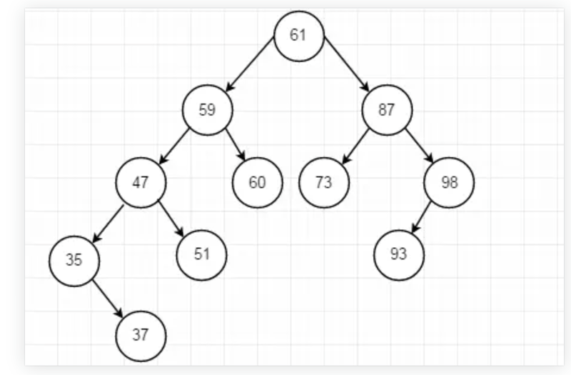

插入代码：

```cpp
struct BiTree {
    int data;
    BiTree *lchild;
    BiTree *rchild;
};

//在二叉排序树中插入查找关键字key
BiTree* InsertBST(BiTree *t,int key)
{
    if (t == NULL)
    {
        t = new BiTree();
        t->lchild = t->rchild = NULL;
        t->data = key;
        return t;
    }

    if (key < t->data)
        t->lchild = InsertBST(t->lchild, key);
    else
        t->rchild = InsertBST(t->rchild, key);

    return t;
}

//n个数据在数组d中，tree为二叉排序树根
BiTree* CreateBiTree(BiTree *tree, int d[], int n)
{
    for (int i = 0; i < n; i++)
        tree = InsertBST(tree, d[i]);
}
```

#### 二叉排序树的删除

二叉树的删除可不再像二叉树的插入那么容易了，以为删除某个结点以后，会影响到树的其它部分的结构。

删除的时候需要考虑以下几种情况：

> 1）删除结点为叶子结点；
> 2）删除的结点只有左子树；
> 3）删除的结点只有右子树
> 4）删除的结点既有左子树又有右子树。

考虑前三种情况，处理方式比较简单。
例如：若要删除上图中的结点 93，则直接删除该结点即可。删除后二叉排序树如图所示：

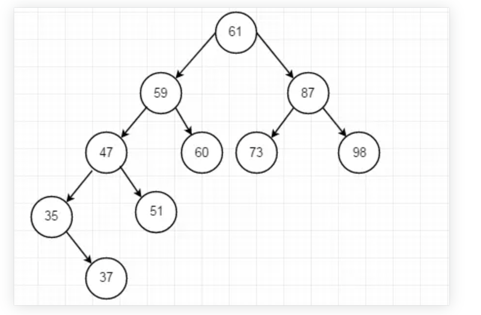

若要删除的结点为结点 35，结点 35 只有右子树，只需删除结点 35，将右子树 37 结点替代结点 35 即可。删除后的二叉排序树如图所示：

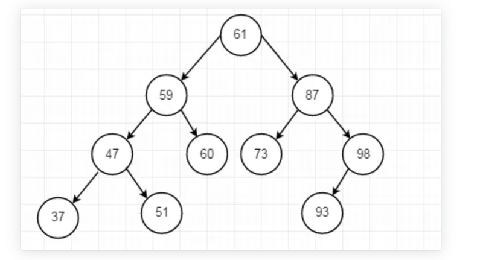

删除只有左子树的结点与此情况类似。

情况 4 相对比较复杂，对于待删除结点既有左子树又有右子树的情形，最佳办法是在剩余的序列中找到最为接近的结点来代替删除结点。这种代替并不会影响到树的整体结构。那么最为接近的结点如何获取呢？
可以采用中序遍历的方式来得到删除结点的前驱和后继结点。选取前驱结点或者后继结点代替删除结点即可。
例如：待删除的结点为 47，图 2.8 中二叉排序树的中序遍历序列为 35 37 47 51 59 60 61 73 87 93 98。则结点 47 的前驱结点为 37，则直接将 37 结点替代 47 结点即可。替换后的二叉排序树如图所示：

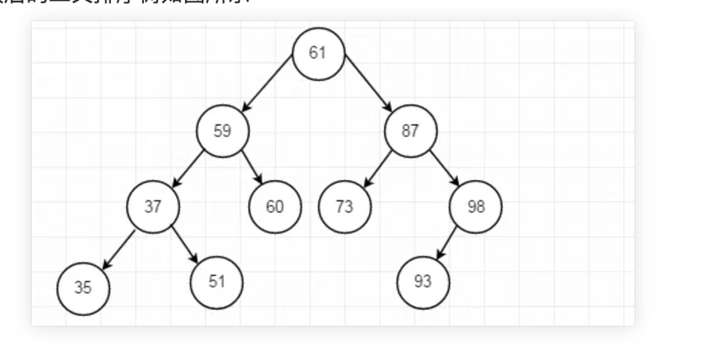

删除代码：

```cpp
/* 若二叉排序树T中存在关键字等于key的数据元素时，则删除该数据元素结点, */
/* 并返回TRUE；否则返回FALSE。 */
Status DeleteBST(BiTree *T,int key)
{
    if(!*T) /* 不存在关键字等于key的数据元素 */
        return FALSE;
    else
    {
        if (key==(*T)->data) /* 找到关键字等于key的数据元素 */
            return Delete(T);
        else if (key<(*T)->data)
            return DeleteBST(&(*T)->lchild,key);
        else
            return DeleteBST(&(*T)->rchild,key);

    }
}
/* 从二叉排序树中删除结点p，并重接它的左或右子树。 */
Status Delete(BiTree *p)
{
    BiTree q,s;
    if((*p)->rchild==NULL) /* 右子树空则只需重接它的左子树（待删结点是叶子也走此分支) */
    {
        q=*p; *p=(*p)->lchild; free(q);
    }
    else if((*p)->lchild==NULL) /* 只需重接它的右子树 */
    {
        q=*p; *p=(*p)->rchild; free(q);
    }
    else /* 左右子树均不空 */
    {
        q=*p; s=(*p)->lchild;
        while(s->rchild) /* 转左，然后向右到尽头（找待删结点的前驱） */
        {
            q=s;
            s=s->rchild;
        }
        (*p)->data=s->data; /*  s指向被删结点的直接前驱（将被删结点前驱的值取代被删结点的值） */
        if(q!=*p)
            q->rchild=s->lchild; /*  重接q的右子树 */
        else
            q->lchild=s->lchild; /*  重接q的左子树 */
        free(s);
    }
    return TRUE;
}
```

### 平衡二叉树

#### 平衡二叉树的插入

只有左孩子才会有右旋操作

只有右孩子才会有左旋操作

##### LL 平衡旋转（右单旋操作）

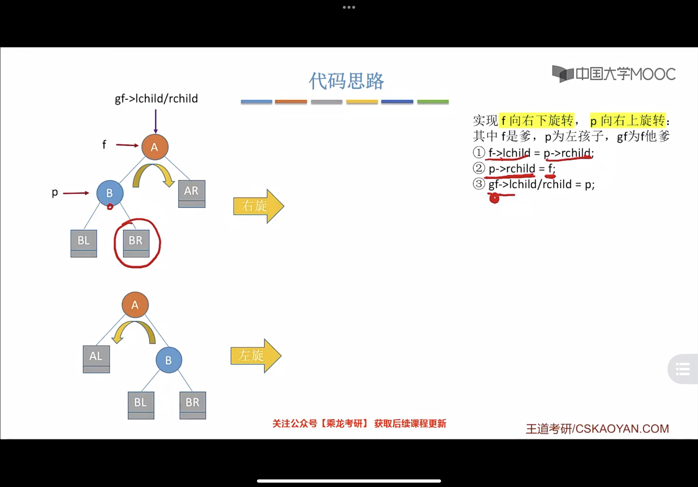

##### RR 平衡旋转（左单旋转）

##### LR

左孩子的右子树插入后导致最小不平衡子树不平衡，故先让左孩子的右子树进行左旋，再让左孩子右旋

##### RL

#### 平衡二叉树的查找

$n_h=n_h-1+n_h-2+1$

平均查找长度为$O(log_2n)$

#### 平衡二叉树的删除

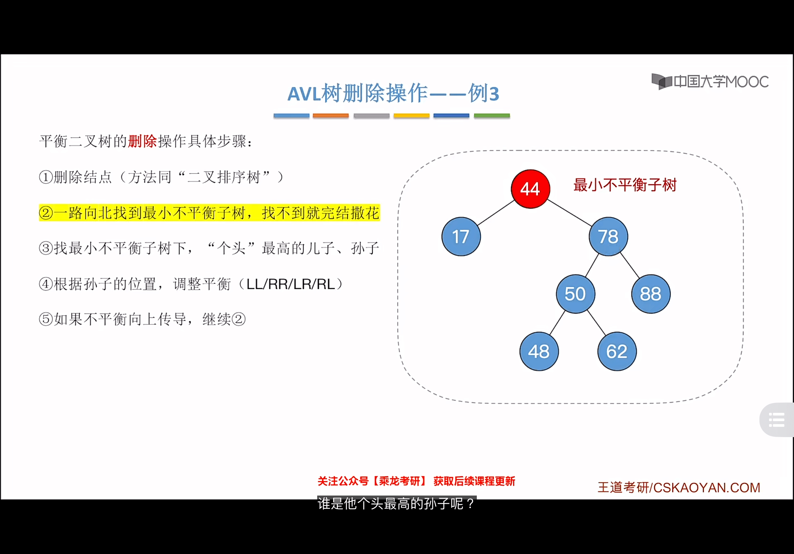

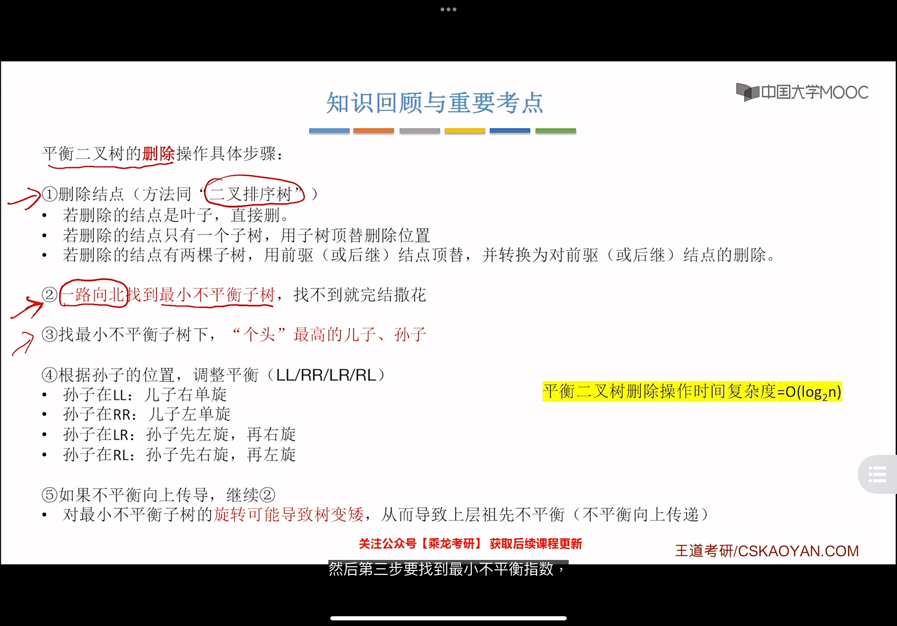

### 红黑树

① 每个结点或是红色，或是黑色的

② 根节点是黑色的

③ 叶结点（外部结点、NULL 结点、失败结点）均是黑色的

④ 不存在两个相邻的红结点（即红结点的父节点和孩子结点均是黑色）

⑤ 对每个结点，从该节点到任一叶结点的简单路径上，所含黑结点的数目相同
