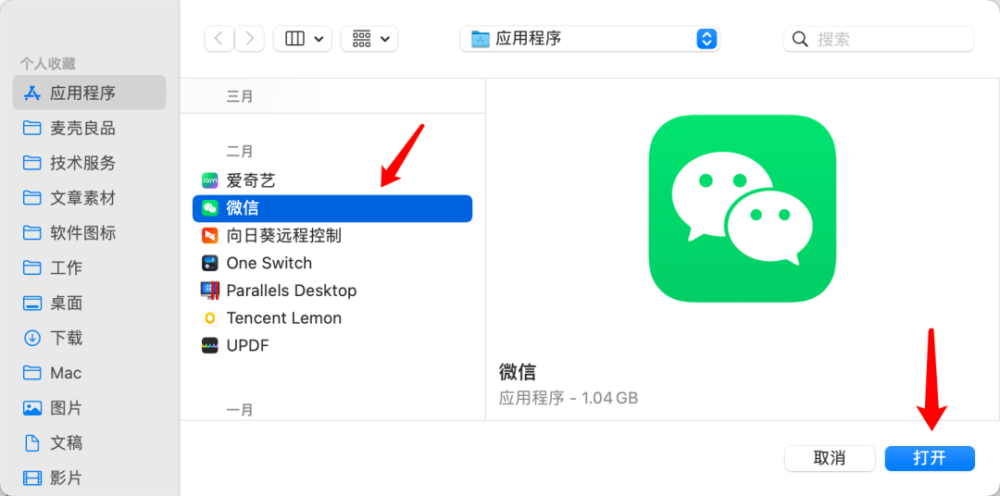

标签

- #有用插件
- #macOS工具 

## Mac 微信多开防撤回插件更新

原创 麦壳菌 Mac _2023-05-08 22:25_ _发表于上海_

最近微信多开插件 Tweak 发布更新，新版本可兼容最新版微信 3.7.1.20 ，并支持「对好友撤回的消息设置背景色」：


**Tweak 主要功能**

一是微信多开，装了 Tweak 之后，在程序坞中微信图标上点击右键，会有「登录新的账号」的选项，点击它，再点击「切换账号」，然后扫码登录你的其他微信，这样在 Mac 上就可以实现多个微信同时在线；


二是「防撤回」：即使好友撤回了消息，你依然可以看到。


**用 Tweak 会封号吗**

关于这个问题，Tweak 开发者主页

（https://github.com/Sunnyyoung/WeChatTweak-macOS）有说明：“在只使用该工具的情况下没有出现过封号/风险提示，若有使用过其他同类工具则有可能会出现封号/风险提示，因此风险自负”。所以，要不要用，你自己选择。


**Tweak 安装方法**

1. 安装 Tweak 需要用到 Homebrew ，Homebrew 是一款软件安装工具，Homebrew 的安装方法可以看我之前的文章：[Homebrew 安装教程](http://mp.weixin.qq.com/s?__biz=MzAxNzcwMTA4Ng==&mid=2247499729&idx=1&sn=1ef2836715a0fb79f45e375725f3c4a0&chksm=9be33e60ac94b776db6c19cf64f605ca75f4984cccbac744b9ddb29710f445d38053c6cf0343&scene=21#wechat_redirect)。

2. 装好 Homebrew 之后，将这条命令：

   ```shell
   brew install sunnyyoung/repo/wechattweak-cli
   ```

   拷贝并粘贴到终端窗口，然后敲回车，就会开始安装：


3. 最后出现「successfully installed」的提示：


4. 重启微信，看看微信的设置里面有没有 Tweak：


5. 如果没有 tweak，说明没有安装成功，再拷贝这条命令：sudo wechattweak-cli install ，在终端粘贴，然后敲回车；


6. 接着可能会提示输入开机密码（Password），直接输入就行，输密码的时候是不会显示任何字符的，输完敲回车。


7. 可能会出现如下图提示，点击「允许...」；


8. 点击「终端」后面的按钮；


9. 出现如下图提示，点击「退出并重新打开」；


10. 然后将以上步骤中的 5 至 6 重新操作一遍，最后出现「Install success」提示，重启微信，如果微信的设置里面有 Tweak ，则表示安装成功！


**其他问题**

启动微信时，如果提示无法打开，怎么办？


这时要分两种情况：

1. 如果你的 Mac 是 M 芯片的，可以打开访达里面的应用程序，选中「微信」，点击右键，点击「显示简介」，勾选「使用 rosetta 打开」，然后就可以启动微信了。


2. 如果你的 Mac 不是 M 芯片的，可以重启 Mac，然后微信就能打开了。

使用微信截图时，出现如下图提示怎么办？


1. 点击上图中的「前往设置」，然后选中微信，再点击左下角的减号；


2. 再点击左下角的加号；


3. 在「应用程序」文件夹中选中微信，点击「打开」；



4. 出现如下图提示，点击「退出并重新打开」，重新登录微信即可使用截图功能。


**Tweak 卸载方法**

拷贝这条命令：`sudo wechattweak-cli uninstall` ，在终端粘贴，然后敲回车即可。


